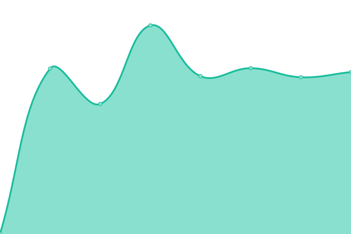

# [📈 Live Status](https://status-ext.wireway.ch): <!--live status--> **🟧 Partial outage**

This repository contains the open-source uptime monitor and status page for [obvTiger](wireway.ch), powered by [Upptime](https://github.com/upptime/upptime).

With [Upptime](https://upptime.js.org), you can get your own unlimited and free uptime monitor and status page, powered entirely by a GitHub repository. We use [Issues](https://github.com/obvTiger/monitor/issues) as incident reports, [Actions](https://github.com/obvTiger/monitor/actions) as uptime monitors, and [Pages](https://status-ext.wireway.ch) for the status page.

<!--start: status pages-->
<!-- This summary is generated by Upptime (https://github.com/upptime/upptime) -->
<!-- Do not edit this manually, your changes will be overwritten -->
<!-- prettier-ignore -->
| URL | Status | History | Response Time | Uptime |
| --- | ------ | ------- | ------------- | ------ |
|  [wireway.ch](https://wireway.ch) | 🟩 Up | [wireway-ch.yml](https://github.com/obvTiger/monitor/commits/HEAD/history/wireway-ch.yml) | 

 593ms
     
 | 

<a href="https://status-ext.wireway.ch/history/wireway-ch">100.00%</a>
    

|  [api.wireway.ch](https://api.wireway.ch) | 🟩 Up | [api-wireway-ch.yml](https://github.com/obvTiger/monitor/commits/HEAD/history/api-wireway-ch.yml) | 

 938ms
     
 | 

<a href="https://status-ext.wireway.ch/history/api-wireway-ch">99.72%</a>
    

|  [repiped.wireway.ch](https://repiped.wireway.ch) | 🟩 Up | [repiped-wireway-ch.yml](https://github.com/obvTiger/monitor/commits/HEAD/history/repiped-wireway-ch.yml) | 

 559ms
     
 | 

<a href="https://status-ext.wireway.ch/history/repiped-wireway-ch">99.73%</a>
    

|  [pipedapi.wireway.ch](https://pipedapi.wireway.ch) | 🟩 Up | [pipedapi-wireway-ch.yml](https://github.com/obvTiger/monitor/commits/HEAD/history/pipedapi-wireway-ch.yml) | 

 1124ms
     
 | 

<a href="https://status-ext.wireway.ch/history/pipedapi-wireway-ch">100.00%</a>
    

|  [piped.wireway.ch](https://piped.wireway.ch) | 🟩 Up | [piped-wireway-ch.yml](https://github.com/obvTiger/monitor/commits/HEAD/history/piped-wireway-ch.yml) | 

 161ms
     
 | 

<a href="https://status-ext.wireway.ch/history/piped-wireway-ch">100.00%</a>
    

|  [streamshare.wireway.ch](https://streamshare.wireway.ch) | 🟩 Up | [streamshare-wireway-ch.yml](https://github.com/obvTiger/monitor/commits/HEAD/history/streamshare-wireway-ch.yml) | 

 513ms
     
 | 

<a href="https://status-ext.wireway.ch/history/streamshare-wireway-ch">97.73%</a>
    

|  [plausible.wireway.ch](https://plausible.wireway.ch) | 🟩 Up | [plausible-wireway-ch.yml](https://github.com/obvTiger/monitor/commits/HEAD/history/plausible-wireway-ch.yml) | 

 572ms
     
 | 

<a href="https://status-ext.wireway.ch/history/plausible-wireway-ch">100.00%</a>
    

|  [data.wireway.ch](https://data.wireway.ch) | 🟩 Up | [data-wireway-ch.yml](https://github.com/obvTiger/monitor/commits/HEAD/history/data-wireway-ch.yml) | 

 180ms
     
 | 

<a href="https://status-ext.wireway.ch/history/data-wireway-ch">100.00%</a>
    

|  [objects.eplg.cloud](https://objects.eplg.cloud) | 🟩 Up | [objects-eplg-cloud.yml](https://github.com/obvTiger/monitor/commits/HEAD/history/objects-eplg-cloud.yml) | 

 564ms
     
 | 

<a href="https://status-ext.wireway.ch/history/objects-eplg-cloud">97.31%</a>
    

|  [objects-cf.eplg.cloud](https://objects-cf.eplg.cloud) | 🟩 Up | [objects-cf-eplg-cloud.yml](https://github.com/obvTiger/monitor/commits/HEAD/history/objects-cf-eplg-cloud.yml) | 

 496ms
     
 | 

<a href="https://status-ext.wireway.ch/history/objects-cf-eplg-cloud">97.66%</a>
    

|  [cdn.wireway.ch](https://cdn.wireway.ch) | 🟥 Down | [cdn-wireway-ch.yml](https://github.com/obvTiger/monitor/commits/HEAD/history/cdn-wireway-ch.yml) | 

 772ms
     
 | 

<a href="https://status-ext.wireway.ch/history/cdn-wireway-ch">69.22%</a>
    

|  [epilogue.team](https://epilogue.team) | 🟩 Up | [epilogue-team.yml](https://github.com/obvTiger/monitor/commits/HEAD/history/epilogue-team.yml) | 

 1082ms
     
 | 

<a href="https://status-ext.wireway.ch/history/epilogue-team">99.83%</a>
    

|  [api.epilogue.team](https://api.epilogue.team) | 🟩 Up | [api-epilogue-team.yml](https://github.com/obvTiger/monitor/commits/HEAD/history/api-epilogue-team.yml) | 

 554ms
     
 | 

<a href="https://status-ext.wireway.ch/history/api-epilogue-team">100.00%</a>
    

|  [auth.epilogue.team](https://auth.epilogue.team) | 🟩 Up | [auth-epilogue-team.yml](https://github.com/obvTiger/monitor/commits/HEAD/history/auth-epilogue-team.yml) | 

 575ms
     
 | 

<a href="https://status-ext.wireway.ch/history/auth-epilogue-team">100.00%</a>
    

|  [emojify.epilogue.team](https://emojify.epilogue.team) | 🟩 Up | [emojify-epilogue-team.yml](https://github.com/obvTiger/monitor/commits/HEAD/history/emojify-epilogue-team.yml) | 

 651ms
     
 | 

<a href="https://status-ext.wireway.ch/history/emojify-epilogue-team">100.00%</a>
    

|  [eplg.cloud](https://eplg.cloud) | 🟩 Up | [eplg-cloud.yml](https://github.com/obvTiger/monitor/commits/HEAD/history/eplg-cloud.yml) | 

 626ms
     
 | 

<a href="https://status-ext.wireway.ch/history/eplg-cloud">99.83%</a>
    

|  [infra-ch-01-controller.eplg.cloud](https://infra-ch-01-controller.eplg.cloud) | 🟩 Up | [infra-ch-01-controller-eplg-cloud.yml](https://github.com/obvTiger/monitor/commits/HEAD/history/infra-ch-01-controller-eplg-cloud.yml) | 

 897ms
     
 | 

<a href="https://status-ext.wireway.ch/history/infra-ch-01-controller-eplg-cloud">100.00%</a>
    

|  [eplg.services](https://eplg.services) | 🟩 Up | [eplg-services.yml](https://github.com/obvTiger/monitor/commits/HEAD/history/eplg-services.yml) | 

 754ms
     
 | 

<a href="https://status-ext.wireway.ch/history/eplg-services">99.83%</a>
    

|  [git.eplg.services](https://git.eplg.services) | 🟩 Up | [git-eplg-services.yml](https://github.com/obvTiger/monitor/commits/HEAD/history/git-eplg-services.yml) | 

 937ms
     
 | 

<a href="https://status-ext.wireway.ch/history/git-eplg-services">99.82%</a>
    

|  [mcss-api.eplg.services](https://mcss-api.eplg.services) | 🟩 Up | [mcss-api-eplg-services.yml](https://github.com/obvTiger/monitor/commits/HEAD/history/mcss-api-eplg-services.yml) | 

 585ms
     
 | 

<a href="https://status-ext.wireway.ch/history/mcss-api-eplg-services">99.84%</a>
    

|  [mcss.eplg.services](https://mcss.eplg.services) | 🟩 Up | [mcss-eplg-services.yml](https://github.com/obvTiger/monitor/commits/HEAD/history/mcss-eplg-services.yml) | 

 701ms
     
 | 

<a href="https://status-ext.wireway.ch/history/mcss-eplg-services">99.84%</a>
    

|  [search.eplg.services](https://search.eplg.services) | 🟩 Up | [search-eplg-services.yml](https://github.com/obvTiger/monitor/commits/HEAD/history/search-eplg-services.yml) | 

 781ms
     
 | 

<a href="https://status-ext.wireway.ch/history/search-eplg-services">99.37%</a>
    

|  [gippity.chat](https://gippity.chat) | 🟩 Up | [gippity-chat.yml](https://github.com/obvTiger/monitor/commits/HEAD/history/gippity-chat.yml) | 

 883ms
     
 | 

<a href="https://status-ext.wireway.ch/history/gippity-chat">99.85%</a>
    

|  [dev.gippity.chat](https://dev.gippity.chat) | 🟩 Up | [dev-gippity-chat.yml](https://github.com/obvTiger/monitor/commits/HEAD/history/dev-gippity-chat.yml) | 

 169ms
     
 | 

<a href="https://status-ext.wireway.ch/history/dev-gippity-chat">100.00%</a>
    

|  [kvs.sh](https://kvs.sh) | 🟩 Up | [kvs-sh.yml](https://github.com/obvTiger/monitor/commits/HEAD/history/kvs-sh.yml) | 

 200ms
     
 | 

<a href="https://status-ext.wireway.ch/history/kvs-sh">100.00%</a>
    

|  [merged.games](https://merged.games) | 🟩 Up | [merged-games.yml](https://github.com/obvTiger/monitor/commits/HEAD/history/merged-games.yml) | 

 299ms
     
 | 

<a href="https://status-ext.wireway.ch/history/merged-games">100.00%</a>
    

|  [beta-1.merged.games](https://beta-1.merged.games) | 🟩 Up | [beta-1-merged-games.yml](https://github.com/obvTiger/monitor/commits/HEAD/history/beta-1-merged-games.yml) | 

 708ms
     
 | 

<a href="https://status-ext.wireway.ch/history/beta-1-merged-games">100.00%</a>
    

|  [gamma-1.merged.games](https://gamma-1.merged.games) | 🟩 Up | [gamma-1-merged-games.yml](https://github.com/obvTiger/monitor/commits/HEAD/history/gamma-1-merged-games.yml) | 

 690ms
     
 | 

<a href="https://status-ext.wireway.ch/history/gamma-1-merged-games">100.00%</a>
    

|  [staging.ziit.app](https://staging.ziit.app/login) | 🟩 Up | [staging-ziit-app.yml](https://github.com/obvTiger/monitor/commits/HEAD/history/staging-ziit-app.yml) | 

 659ms
     
 | 

<a href="https://status-ext.wireway.ch/history/staging-ziit-app">100.00%</a>
    

|  [ziit.app (external)](https://ziit.app/login) | 🟩 Up | [ziit-app-external.yml](https://github.com/obvTiger/monitor/commits/HEAD/history/ziit-app-external.yml) | 

 670ms
     
 | 

<a href="https://status-ext.wireway.ch/history/ziit-app-external">100.00%</a>
    

|  [pandadev.net (external)](https://pandadev.net) | 🟩 Up | [pandadev-net-external.yml](https://github.com/obvTiger/monitor/commits/HEAD/history/pandadev-net-external.yml) | 

 366ms
     
 | 

<a href="https://status-ext.wireway.ch/history/pandadev-net-external">100.00%</a>
    

|  [waradu.dev (external)](https://waradu.dev) | 🟩 Up | [waradu-dev-external.yml](https://github.com/obvTiger/monitor/commits/HEAD/history/waradu-dev-external.yml) | 

 252ms
     
 | 

<a href="https://status-ext.wireway.ch/history/waradu-dev-external">100.00%</a>
    

|  [minipandi.net (external)](https://minipandi.net) | 🟩 Up | [minipandi-net-external.yml](https://github.com/obvTiger/monitor/commits/HEAD/history/minipandi-net-external.yml) | 

 624ms
     
 | 

<a href="https://status-ext.wireway.ch/history/minipandi-net-external">99.65%</a>
    

<!--end: status pages-->

[**Visit our status website →**](https://status-ext.wireway.ch)

## 📄 License

- Powered by: [Upptime](https://github.com/upptime/upptime)
- Code: [MIT](./LICENSE) © [Anand Chowdhary](https://anandchowdhary.com), supported by [Pabio](https://pabio.com)
- Data in the `./history` directory: [Open Database License](https://opendatacommons.org/licenses/odbl/1-0/)
